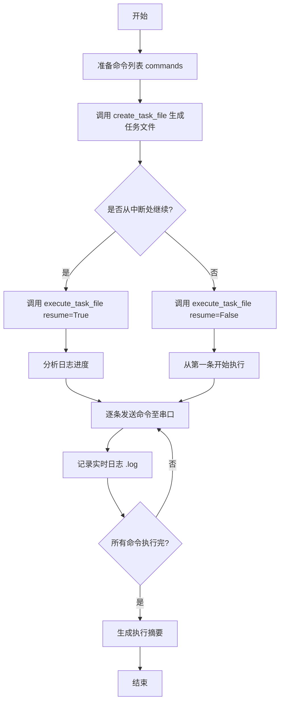

# skill-serial-connector

[](https://github.com/blacksamuraiiii/skill-serial-connector)
[](https://github.com/blacksamuraiiii/skill-serial-connector)

`skill-serial-connector` 是一个专为 Windows 环境设计的交换机串口自动化工具。它不仅是一个独立的 Python 库，更是一个完全符合 **Claude Code Agent SKILL** 规范的智能插件。通过集成 `plink.exe`，它能够让 AI 助手直接接管串口，实现对中兴、华为、思科等主流厂商设备的协议扫描、配置下发及故障排查。

---

## 🤖 AI Agent 兼容性

本项目严格遵循 **Agent Skills 开源标准**，可无缝集成至 Claude Code、Cursor 等主流 AI 编程助手：

- **自动化指令转换**：AI 助手可阅读 `references/` 下的厂商手册，自动将自然语言（如“把 gei-2/1 换到 VLAN 10”）转换为对应厂商的 CLI 命令。
- **自描述调用界面**：通过 `SKILL.md` 定义的任务协议，AI 助手能自主决定何时调用 `serial_connector.py` 进行物理交互。
- **状态感知执行**：AI 能通过读取 `.log` 文件实时感知设备反馈，并根据错误提示（如 `Error 140303`）自动修正命令逻辑。
- **无感断点续传**：当 AI 任务因 Token 限制或网络波动中断时，新的 Agent 实例能通过日志自动定位进度，实现无缝接力。

---

## ✨ 核心功能

- **🚀 自动化任务管理**：通过 API 快速生成任务文件（`.txt`）并执行。
- **⏱️ 统一命名规范**：任务文件与日志文件共享相同的时间戳（`{厂家}_{时间戳}`），便于回溯。
- **🔄 断点续传机制**：自动分析已执行日志，支持在异常中断后从最后一条成功命令继续执行。
- **🛡️ Windows 深度优化**：
  - 针对 Windows 处理串口输入流的特性，修复了 `OSError [Errno 22] Invalid argument` 错误。
  - 使用 `\n` 替代 `\r` 提高不同厂商设备的兼容性。
- **🧹 目录分离架构**：SKILL 核心文件与运行生成的临时文件完全分离，保持项目目录纯净。
- **📚 多厂商预设**：内置中兴 (ZTE)、华为 (HW)、H3C、锐捷 (Ruijie)、思科 (Cisco) 的常用指令参考。

---

## 💻 系统要求

- **操作系统**：Windows 10 / 11 x64
- **运行环境**：Python 3.8+
- **依赖工具**：`assets/plink.exe` (已内置)

---

## 🛠️ 调用流程



---

## 🚀 快速开始

### 1. 自动生成并执行（推荐）

这是最简单的调用方式，只需准备好厂商、端口、密码和命令列表：

```python
from scripts.serial_connector import create_task_file, execute_task_file

# 1. 定义配置
commands = [
    "enable",
    "configure terminal",
    "interface gei-2/1",
    "switchport mode access",
    "switchport access vlan 10",
    "exit"
]

# 2. 创建任务文件（会自动生成带时间戳的文件，如 ZTE_20260129_190900.txt）
task_file, log_file = create_task_file(
    vendor="ZTE",
    com_port="COM6",
    baud_rate=115200,
    password="your_password",
    commands=commands,
    output_dir="." # 输出到当前目录
)

# 3. 执行任务
result = execute_task_file(task_file, resume=True)

if result.get("status") == "success":
    print(f"执行成功！日志保存在: {result['log_file']}")
```

### 2. 任务文件格式

你也可以手动创建任务文件执行：

```ini
[METADATA]
vendor=ZTE
com_port=COM6
baud_rate=115200
password=admin
log_file=ZTE_20260129_193000.log

[COMMANDS]
show version
show interface brief

[END]
```

---

## 📁 文件结构

```text
skill-serial-connector/
├── SKILL.md                    # 详细技术规格文档
├── task_template.txt           # 任务文件标准模板
├── scripts/
│   └── serial_connector.py     # 核心 Python 逻辑 (v0.1)
├── assets/
│   └── plink.exe              # 串口通信核心组件
├── references/                 # 厂商指令参考手册
│   ├── zte-commands.md
│   ├── hw-commands.md
│   ├── h3c-commands.md
│   ├── ruijie-commands.md
│   └── cisco-commands.md
└── (生成的临时文件)             # 运行后出现在工作目录，不影响以上结构
    ├── ZTE_20260129_190900.txt
    └── ZTE_20260129_190900.log
```

---

## ❌ 错误说明与排查

| 错误特征                        | 可能原因               | 解决方法                                                                 |
| :------------------------------ | :--------------------- | :----------------------------------------------------------------------- |
| **Error 140303**          | 模式错误或语法错误     | 确认是否已执行 `enable` 进入特权模式或 `config t` 进入配置模式。     |
| **Error 140251**          | 密码输入超时           | 检查密码是否正确，或增加 `wait_time` 延迟。                            |
| **OSError [Errno 22]**    | Windows 进程管道异常   | `v0.1已修复`。确保使用最新脚本，会自动检查进程状态并使用 `\n` 换行。 |
| **Timeout / No Response** | 串口占用或参数配置错误 | 检查 COM 口号是否被其他软件（如 Putty）占用；确认波特率（默认 115200）。 |

---

## ⚠️ 开发注意事项

1. **命令顺序**：交换机通常有严格的模式层级（用户模式 -> 特权模式 -> 全局配置模式）。在 `commands` 列表中必须包含 `enable` 或 `configure terminal` 等切换指令。
2. **连接占用**：本工具运行期间会独占串口，请关闭第三方串口调试助手。
3. **安全提示**：请勿在 `password` 字段中硬编码敏感生产密码，建议使用环境变量或输入提示。

---

## 🔗 项目链接

- **GitHub**: [blacksamuraiiii/skill-serial-connector](https://github.com/blacksamuraiiii/skill-serial-connector)
- **License**: MIT

---

*Last Updated: 2026-01-29*
